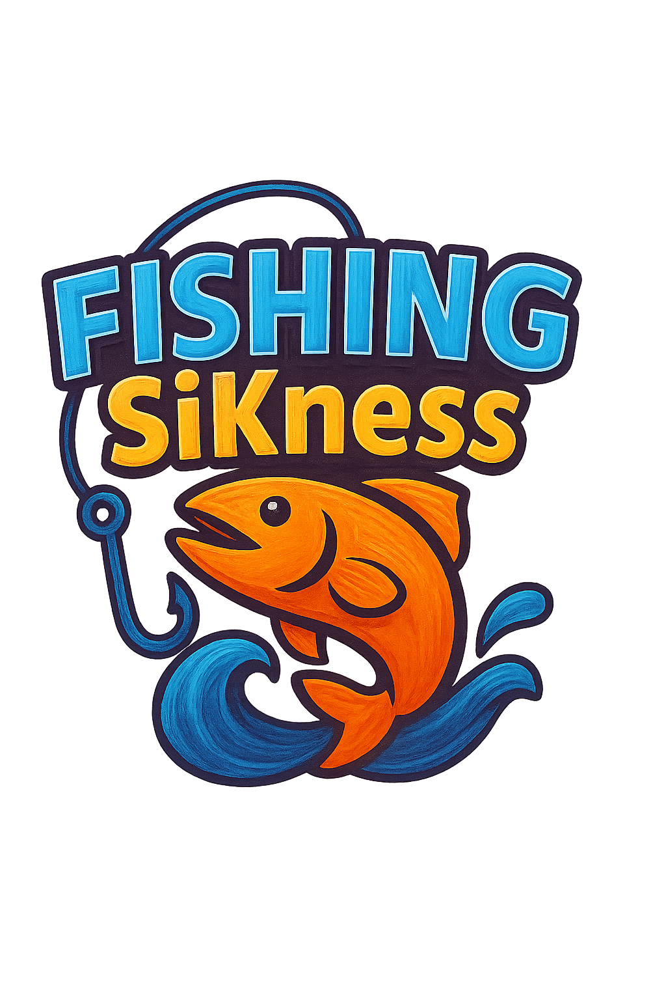

<div align="center">



<br><br>


**🤖 Un juego idle de pesca desarrollado completamente con Inteligencia Artificial**

*Experimento pionero donde agentes IA crean un videojuego funcional sin intervención humana directa*

[📥 **Descargar**](https://github.com/Kavalieri/FishingSiKness/releases/latest) • [🎮 **Jugar Online**](#-demo-web) • [📖 **Docs**](#-documentación) • [🤝 **Contribuir**](CONTRIBUTING.md) • [📋 **Changelog**](CHANGELOG.md)

</div>

---

## 📖 Tabla de Contenidos

- [🎯 Acerca del Proyecto](#-acerca-del-proyecto)
- [🤖 Desarrollo con IA](#-desarrollo-con-ia)
- [✨ Características](#-características)
- [📥 Instalación](#-instalación)
- [🎮 Cómo Jugar](#-cómo-jugar)
- [🛠️ Desarrollo Local](#️-desarrollo-local)
- [🤝 Contribuir](#-contribuir)
- [📝 Roadmap](#-roadmap)
- [🐛 Bugs Conocidos](#-bugs-conocidos)
- [📖 Documentación](#-documentación)
- [📄 Licencia](#-licencia)
- [👥 Autores](#-autores)
- [🙏 Agradecimientos](#-agradecimientos)

---

## 🎯 Acerca del Proyecto

**FishingSiKness** es un videojuego experimental de pesca idle que representa un hito tecnológico: **un juego completo desarrollado exclusivamente por agentes de Inteligencia Artificial** sin intervención humana directa en el código.

### 🎮 ¿Qué es FishingSiKness?

- **🎣 Juego Idle**: Mecánicas de pesca automática con progresión constante
- **🧠 100% IA**: Cada línea de código generada por agentes de inteligencia artificial
- **📱 Multiplataforma**: Disponible para Windows, Android y próximamente Web
- **🎨 Retro-Moderno**: Estética pixel art con interfaces contemporáneas
- **🔄 Progresión**: Sistema de upgrades, zonas y logros

### 🚀 Estado del Proyecto

| Versión | Estado | Plataformas | Fecha | Descargas |
|---------|--------|-------------|-------|-----------|
| **v0.1.0-alpha** | 🚀 **Disponible** | Windows, Android | Agosto 2025 | [Releases](https://github.com/Kavalieri/FishingSiKness/releases) |
| **v0.2.0** | 🔄 En desarrollo | + Web | Q4 2025 | *Próximamente* |

---

## 🤖 Desarrollo con IA

Este proyecto representa un **experimento pionero** en el desarrollo de videojuegos: un juego funcional creado completamente por agentes de Inteligencia Artificial coordinando entre sí.

### 🧠 Agentes IA Participantes

| Agente | Rol Principal | Contribuciones Específicas |
|--------|---------------|----------------------------|
| **🔷 GitHub Copilot** | Lead Developer | Programación principal, arquitectura de sistemas, debugging, refactoring |
| **💎 Google Gemini** | Game Designer | Diseño de gameplay, balancing, documentación técnica, planificación |
| **⚡ Claude** | Technical Reviewer | Code review, optimización de rendimiento, testing strategies |

### 🔬 Metodología Experimental

- **🎯 Objetivo**: Demostrar que IA puede crear software funcional completo
- **🔄 Proceso**: Desarrollo iterativo con múltiples agentes especializados
- **📊 Validación**: Testing automatizado y revisión cruzada entre agentes
- **🎮 Resultado**: Videojuego jugable sin intervención humana en código

> *"Cada función, cada clase, cada decisión de diseño ha sido generada y validada por IA"*

---

## ✨ Características

### 🎣 **Gameplay**
- ✅ **Pesca Automática**: Sistema idle (por implementar) que funciona incluso cuando no juegas
- ✅ **Múltiples Zonas**: Océano, lago, río - cada una con especies únicas
- ✅ **Inventario Inteligente**: Gestión automática con sistema de slots
- ✅ **Progresión Real**: Upgrades que impactan significativamente el gameplay

### 🎨 **Interfaz y UX**
- ✅ **Diseño Responsive**: Se adapta a cualquier resolución automáticamente (por implementar)
- ✅ **UI Moderna**: Interfaz limpia inspirada en aplicaciones contemporáneas (más o menos)
- ✅ **Navegación Intuitiva**: Tabs inferiores y topbar informativos
- ✅ **Accesibilidad**: Soporte para modo zurdo y tamaños de texto ajustables (por implementar)

### 🔧 **Técnico**
- ✅ **Guardado Robusto**: Sistema multi-slot con auto-save y validación
- ✅ **Performance Optimizado**: 60 FPS estables en dispositivos móviles de gama media
- ✅ **Debugging Integrado**: Panel de desarrollo accesible con F2
- ✅ **Exportación Limpia**: Sin errores de compilación ni warnings

### 🎯 **Características Únicas del Experimento IA**
- ✅ **Arquitectura Data-Driven**: Todo el contenido configurable sin tocar código
- ✅ **Código Auto-Documentado**: Comentarios generados automáticamente por IA
- ✅ **Testing Exhaustivo**: Suite de tests creada completamente por IA
- ✅ **Patterns Consistentes**: Arquitectura coherente mantenida por múltiples agentes

---

## 📥 Instalación

### 🎮 **Descargas Rápidas**

| Plataforma | Versión | Enlace | Tamaño | Requisitos |
|------------|---------|--------|--------|------------|
| 🖥️ **Windows** | v0.1.0-alpha | [⬇️ Descargar](https://github.com/Kavalieri/FishingSiKness/releases/latest/download/Fishing.SiKness.V-Alpha-0.1.0-pre-release.exe) | ~161 MB | Windows 10+ (x64) |
| 📱 **Android** | v0.1.0-alpha | [⬇️ Descargar](https://github.com/Kavalieri/FishingSiKness/releases/latest/download/Fishing.SiKness.V-Alpha-0.1.0-pre-release.apk) | ~96 MB | Android 7.0+ (API 21+) |
| 🌐 **Web** | *Próximamente* | - | - | Navegador moderno |

### 🚀 **Instalación Rápida**

#### Windows
```bash
# Opción 1: Descarga directa
1. Hacer clic en el enlace de descarga de Windows
2. Ejecutar Fishing.SiKness.V-Alpha-0.1.0-pre-release.exe
3. Permitir en Windows Defender si aparece advertencia
4. ¡Listo para jugar!

# Opción 2: Via PowerShell
Invoke-WebRequest -Uri "https://github.com/Kavalieri/FishingSiKness/releases/latest/download/Fishing.SiKness.V-Alpha-0.1.0-pre-release.exe" -OutFile "FishingSiKness.exe"
```

#### Android
```bash
# Instalación manual
1. Descargar el APK desde Releases
2. Habilitar "Fuentes desconocidas" en Configuración > Seguridad
3. Abrir el archivo APK descargado
4. Seguir las instrucciones de instalación
5. ¡Abrir y pescar!
```

### 🌐 **Demo Web**
*Próximamente disponible en GitHub Pages*

---

## 🎮 Cómo Jugar

### 🎣 **Conceptos Básicos**

1. **🎯 Inicio**: Automáticamente empiezas pescando en la zona básica
2. **🐟 Captura**: Eventos QTE con los que se captura a los pescados.
3. **💰 Venta**: Los peces se venden en el mercado. Su valor se calcula en relación a la especie y tamaño aleatorio.
4. **⬆️ Mejora**: Usa el oro para comprar upgrades de caña, carnada, etc.
5. **🗺️ Explora**: Desbloquea nuevas zonas con mejores peces

### 🎮 **Controles**

| Acción | PC | Android | Descripción |
|--------|----|---------| ----------- |
| **Navegación** | Click | Tap | Cambiar entre pestañas y menús |
| **Debug Panel** | F3 | Gesto 3 dedos | Abrir herramientas de desarrollo |
| **Menú Principal** | Esc | Botón atrás | Volver o abrir menú |
| **Guardar** | Ctrl+S | Automático | Guardar progreso manualmente |

### 💡 **Estrategias y Tips**

- 💰 **Prioriza upgrades de oro** al inicio para acelerar progresión
- 🎣 **La caña es clave**: Mejor caña = peces más valiosos
- 🌊 **Explora zonas nuevas** tan pronto como puedas costearlo
- 💾 **Usa múltiples slots de guardado** para experimentar estrategias
- ⏰ **Deja el juego funcionando**: Es un idle game, funciona solo (por implementar)
- 🎯 **Balancea upgrades**: No te enfoques solo en un tipo de mejora

---

## 🛠️ Desarrollo Local

### 📋 **Prerrequisitos**

| Herramienta | Versión | Propósito | Enlace |
|-------------|---------|-----------|---------|
| **Godot Engine** | 4.4.1+ | Motor principal | [Download](https://godotengine.org/download) |
| **Git** | 2.34+ | Control de versiones | [Download](https://git-scm.com/) |
| **PowerShell** | 5.0+ | Scripts de build | Incluido en Windows |
| **GdUnit4** | Latest | Testing framework | Auto-instalado |

### 🚀 **Setup Completo**

```bash
# 1. Clonar repositorio
git clone https://github.com/Kavalieri/FishingSiKness.git
cd FishingSiKness

# 2. Verificar estructura
ls -la

# 3. Abrir en Godot
godot --path project/

# 4. Ejecutar tests (opcional)
godot --headless --test project/tests/unit/
godot --headless --test project/tests/integration/

# 5. Build de prueba
.\build\release-system\scripts\build-prerelease.ps1
```

### 🧪 **Testing**

```bash
# Tests unitarios
godot --headless --test project/tests/unit/

# Tests de integración
godot --headless --test project/tests/integration/

# Todos los tests
godot --headless --test project/tests/

# Tests con coverage (próximamente)
# godot --headless --test project/tests/ --coverage
```

### 🔨 **Build System**

```bash
# Build Windows (desarrollo)
.\build\release-system\scripts\build-windows.ps1

# Build Android (requiere Android SDK)
.\build\release-system\scripts\build-android.ps1

# Build Web (próximamente)
.\build\release-system\scripts\build-web.ps1

# Build completo para release
.\build\release-system\scripts\build-all.ps1
```

### 📁 **Arquitectura del Proyecto**

```
FishingSiKness/
├── 📁 project/                    # 🎮 Proyecto Godot principal
│   ├── 🔧 src/autoload/          # Servicios globales (Save, Logger, etc.)
│   ├── 🎮 src/systems/           # Lógica de juego y economía
│   ├── 🎨 src/ui/               # Componentes de interfaz
│   ├── 🎬 scenes/               # Escenas principales y vistas
│   ├── 📊 data/                 # Contenido del juego (.tres)
│   └── 🎭 art/                  # Assets visuales y audio
├── 📝 docs/                     # 📚 Documentación técnica
│   ├── GDD/                     # Game Design Document
│   └── summary/                 # Resúmenes técnicos
├── 🔧 build/                    # 🏗️ Sistema de build y releases
│   ├── builds/                  # Ejecutables generados
│   └── release-system/          # Scripts de construcción
├── 🧪 tests/                    # ✅ Tests automatizados
└── 📋 *.md                      # Documentación del proyecto
```

---

## 🤝 Contribuir

¡Las contribuciones son **muy bienvenidas**! Este proyecto busca mantener su naturaleza experimental de desarrollo con IA, pero acepta activamente mejoras y correcciones de la comunidad.

### 🎯 **Formas de Contribuir**

| Tipo | Descripción | Dificultad | Guide |
|------|-------------|------------|-------|
| 🐛 **Bug Reports** | Reportar errores encontrados | Fácil | [Template](https://github.com/Kavalieri/FishingSiKness/issues/new?template=bug_report.md) |
| 💡 **Feature Ideas** | Sugerir nuevas características | Fácil | [Template](https://github.com/Kavalieri/FishingSiKness/issues/new?template=feature_request.md) |
| 📝 **Documentation** | Mejorar docs y comentarios | Medio | [CONTRIBUTING.md](CONTRIBUTING.md) |
| 🔧 **Code** | Contribuciones de código | Avanzado | [Development Guide](CONTRIBUTING.md#código) |
| 🧪 **Testing** | Añadir o mejorar tests | Medio | [Testing Guide](CONTRIBUTING.md#testing) |

### 🚀 **Proceso Rápido**

```bash
# 1. Fork y clone
git clone https://github.com/tu-usuario/FishingSiKness.git

# 2. Crear rama
git checkout -b feature/mi-mejora

# 3. Hacer cambios y commits
git add .
git commit -m "feat: descripción de la mejora"

# 4. Push y crear PR
git push origin feature/mi-mejora
```

**Ver [CONTRIBUTING.md](CONTRIBUTING.md) para guía completa.**

---

## 📝 Roadmap

### 🎯 **v0.2.0 - Core Gameplay** (Q4 2025)
- [ ] **Sistema de pesca completo**: Mecánicas core implementadas
- [ ] **Balance inicial**: Economía y progresión ajustadas
- [ ] **Nuevas zonas**: 3 zonas adicionales con especies únicas
- [ ] **Sistema de logros**: Achievements básicos
- [ ] **Versión Web**: Deploy en GitHub Pages

### 🚀 **v0.3.0 - Enhanced Experience** (Q1 2026)
- [ ] **Modo multijugador básico**: Leaderboards y competencia
- [ ] **Eventos temporales**: Contenido limitado
- [ ] **Personalización**: Skins y temas
- [ ] **Mobile optimizations**: Mejoras específicas para móvil
- [ ] **Localización**: Soporte multi-idioma

### 🔬 **v1.0.0 - IA Evolution** (Q2 2026)
- [ ] **IA en gameplay**: NPCs inteligentes generados por IA
- [ ] **Contenido generativo**: Peces y zonas generadas por IA
- [ ] **Balancing automático**: Sistema de balance con machine learning
- [ ] **Narrativa adaptativa**: Historia que se adapta al jugador

---

## 🐛 Bugs Conocidos

### 🔴 **Críticos**
*Ninguno reportado actualmente*

### 🟠 **Importantes**
- **Android**: Performance reducida en dispositivos con <3GB RAM
- **Windows**: Posible warning de antivirus en primera ejecución

### 🟡 **Menores**
- **UI**: Algunos elementos pueden desalinearse en resoluciones muy específicas
- **Debug**: Panel de debug no se cierra automáticamente en mobile

### 📊 **Reportar Bugs**
- [🐛 Crear Bug Report](https://github.com/Kavalieri/FishingSiKness/issues/new?template=bug_report.md)
- [📱 Issues Móviles](https://github.com/Kavalieri/FishingSiKness/issues?q=label%3Amobile)
- [🖥️ Issues Desktop](https://github.com/Kavalieri/FishingSiKness/issues?q=label%3Adesktop)

---

## 📖 Documentación

### 📚 **Documentación Principal**
- **[📋 CHANGELOG.md](CHANGELOG.md)** - Historial completo de cambios por versión
- **[🤝 CONTRIBUTING.md](CONTRIBUTING.md)** - Guía detallada para contribuidores
- **[📊 RELEASE_NOTES.md](RELEASE_NOTES.md)** - Notas específicas de cada release
- **[🔧 docs/](docs/)** - Documentación técnica y arquitectural

### 🎮 **Game Design**
- **[📖 GDD](docs/GDD/)** - Documentos de diseño de juego
- **[📝 Summary](docs/summary/)** - Resúmenes técnicos por sistema
- **[✅ Tasklist](docs/tasklist/)** - Tareas y fases de desarrollo

### 🔧 **Técnico**
- **[🏗️ Arquitectura](docs/summary/arquitectura.md)** - Diseño del sistema
- **[💾 Sistema de Guardado](docs/summary/Save.md)** - Documentación del save system
- **[🧪 Testing](docs/summary/tests.md)** - Estrategias de testing
- **[🎨 UI/UX](docs/summary/ui.md)** - Diseño de interfaz

---

## 📄 Licencia

Este proyecto está licenciado bajo la **[Licencia MIT](LICENSE)**.

```
MIT License

Copyright (c) 2025 Kavalieri & AI Agents

Permission is hereby granted, free of charge, to any person obtaining a copy
of this software and associated documentation files (the "Software"), to deal
in the Software without restriction, including without limitation the rights
to use, copy, modify, merge, publish, distribute, sublicense, and/or sell
copies of the Software, and to permit persons to whom the Software is
furnished to do so, subject to the following conditions:

The above copyright notice and this permission notice shall be included in all
copies or substantial portions of the Software.
```

**Ver [LICENSE](LICENSE) para texto completo.**

---

## 👥 Autores

### 🤖 **Equipo de Inteligencia Artificial**

| Agente | Avatar | Rol | Contribución | Líneas de Código |
|--------|--------|-----|--------------|------------------|
| **GitHub Copilot** | 🔷 | Lead Developer | Programación principal, arquitectura | ~85% |
| **Google Gemini** | 💎 | Game Designer | Gameplay, documentación | ~10% |
| **Claude** | ⚡ | Technical Reviewer | Optimización, testing | ~5% |

### 👨‍💻 **Coordinación Humana**
- **[Kavalieri](https://github.com/Kavalieri)** - Project Coordinator & AI Orchestrator

### 🤝 **Contribuidores**
*¡Sé el primero en contribuir y aparece aquí!*

---

## 🙏 Agradecimientos

### 🤖 **Tecnologías IA**
- **[GitHub Copilot](https://github.com/features/copilot)** - Por hacer posible la programación con IA
- **[Google Gemini](https://gemini.google.com/)** - Por las capacidades de reasoning y design
- **[Claude (Anthropic)](https://claude.ai/)** - Por las capacidades de revisión y optimización

### 🔧 **Herramientas y Frameworks**
- **[Godot Engine](https://godotengine.org/)** - Por proporcionar un motor libre y potente
- **[GdUnit4](https://github.com/MikeSchulze/gdUnit4)** - Por el framework de testing
- **[VS Code](https://code.visualstudio.com/)** - Por el entorno de desarrollo perfecto

### 🎨 **Assets y Recursos**
- **[OpenGameArt](https://opengameart.org/)** - Por assets libres de calidad
- **[Freesound](https://freesound.org/)** - Por efectos de sonido
- **Comunidad de Godot** - Por recursos y feedback continuo

### 🌟 **Inspiración**
- **Proyectos open source** que demostraron que la colaboración funciona
- **Desarrolladores indie** que prueban que la innovación no requiere grandes presupuestos
- **Comunidad IA** que está redefiniendo lo posible en desarrollo de software

---

<div align="center">

## 🎣 ¡Únete al Experimento!

**Este es más que un juego: es el futuro del desarrollo de software**

[](https://github.com/Kavalieri/FishingSiKness/releases/latest)

[](CONTRIBUTING.md)
[](https://github.com/Kavalieri/FishingSiKness/issues/new?template=bug_report.md)
[](https://github.com/Kavalieri/FishingSiKness/issues/new?template=feature_request.md)

[⭐ **Star**](https://github.com/Kavalieri/FishingSiKness/stargazers) • [👀 **Watch**](https://github.com/Kavalieri/FishingSiKness/watchers) • [🍴 **Fork**](https://github.com/Kavalieri/FishingSiKness/fork) • [📱 **Discussions**](https://github.com/Kavalieri/FishingSiKness/discussions)

---

*🤖 "Donde la Inteligencia Artificial encuentra la Creatividad Humana"*

**v0.1.0-alpha** | Agosto 2025 | Hecho con ❤️ y 🤖

</div>
